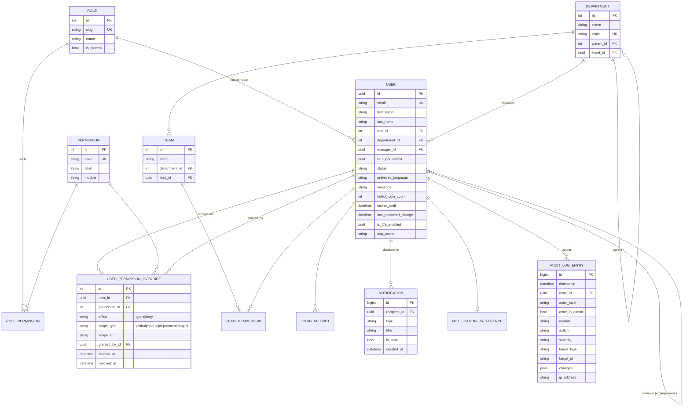

# Schéma de la base de données

État après la **Phase 1**. Le schéma s'enrichit à chaque phase.

## Diagramme (Phase 1)



## Moteur de permission effective

```
effective(user, code, scope) :
  si user.is_super_admin                       → True
  base   = code ∈ permissions(role de l'user)
  ovs    = overrides actifs (non révoqués) de l'user pour `code`, dont le périmètre correspond à `scope`
  si un ov.effect == "deny" dans ovs           → False
  si un ov.effect == "grant" dans ovs          → True
  sinon                                        → base
```

Implémentation : `backend/apps/permissions/services.py`
(`has_permission`, `effective_permissions`, `Scope`).

## Journal d'audit — garanties d'immuabilité

- `AuditLogEntry.save()` lève une exception si `pk` est déjà défini (pas d'`UPDATE`).
- `AuditLogEntry.delete()` lève une exception (la purge de rétention utilise `_raw_delete`).
- Aucun `ModelViewSet` d'écriture : seules `list` / `retrieve` / `export` sont exposées.
- Rétention : `apps/audit/tasks.purge_audit_log` (archive CSV vers MinIO, puis purge > 365 j).

## Migrations

```
accounts/0001_initial, 0002_initial
organization/0001_initial
permissions/0001_initial, 0002_seed_catalog   # catalogue de permissions + rôles système
audit/0001_initial
notifications/0001_initial
```
