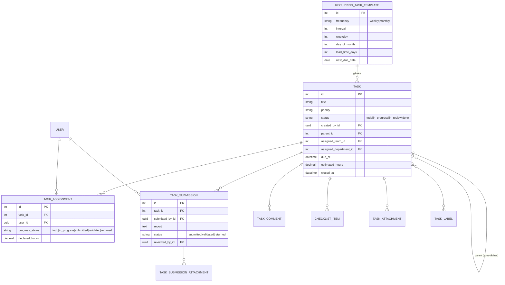
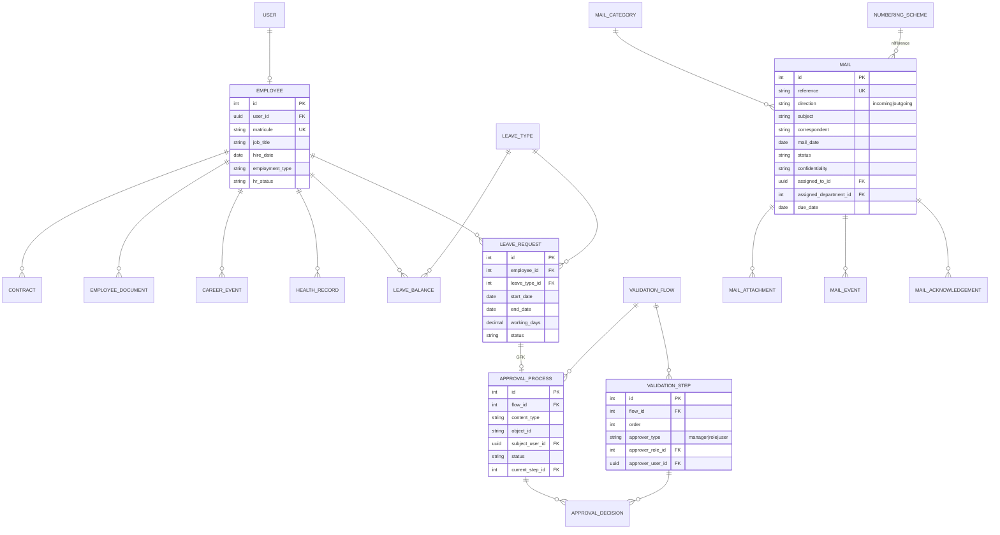

# Schéma de la base de données

État après la **Phase 3**. Le schéma s'enrichit à chaque phase.

## Diagramme (Phase 3 — Tâches)



Clôture : `Task.recompute_status()` passe en `done` quand toutes les
`TaskAssignment` sont `validated` ; sinon en `in_review` dès qu'une soumission
existe. Le chef peut forcer le statut (`/tasks/{id}/status/`).

## Diagramme (Phase 2 — RH, Courrier, validation)



### Circuit de validation (moteur générique)

`start_approval(objet, flow_code)` crée un `ApprovalProcess` lié par
GenericForeignKey. Chaque `submit_decision` :
- `approved` → étape suivante résolvable, ou état `approved` si dernière ;
- `rejected` → `ApprovalProcess.status = rejected` ;
- `returned` → `cancelled` (retour brouillon côté objet).
À l'état terminal, le moteur appelle le hook correspondant sur l'objet
(`on_approval_approved` / `_rejected` / `_returned`). Pour les congés,
`on_approval_approved` décompte les jours du `LeaveBalance`.

## Diagramme (Phase 1)

## Diagramme (Phase 1)


## Moteur de permission effective

```
effective(user, code, scope) :
  si user.is_super_admin                       → True
  base   = code ∈ permissions(role de l'user)
  ovs    = overrides actifs (non révoqués) de l'user pour `code`, dont le périmètre correspond à `scope`
  si un ov.effect == "deny" dans ovs           → False
  si un ov.effect == "grant" dans ovs          → True
  sinon                                        → base
```

Implémentation : `backend/apps/permissions/services.py`
(`has_permission`, `effective_permissions`, `Scope`).

## Journal d'audit — garanties d'immuabilité

- `AuditLogEntry.save()` lève une exception si `pk` est déjà défini (pas d'`UPDATE`).
- `AuditLogEntry.delete()` lève une exception (la purge de rétention utilise `_raw_delete`).
- Aucun `ModelViewSet` d'écriture : seules `list` / `retrieve` / `export` sont exposées.
- Rétention : `apps/audit/tasks.purge_audit_log` (archive CSV vers MinIO, puis purge > 365 j).

## Migrations

```
accounts/0001_initial, 0002_initial
organization/0001_initial
permissions/0001_initial, 0002_seed_catalog, 0003_phase2_catalog
audit/0001_initial
notifications/0001_initial
permissions/0004_phase3_catalog
validation/0001_initial, 0002_seed_leave_flow
hr/0001_initial, 0002_seed_leave_types_holidays
correspondence/0001_initial
tasks/0001_initial
```
